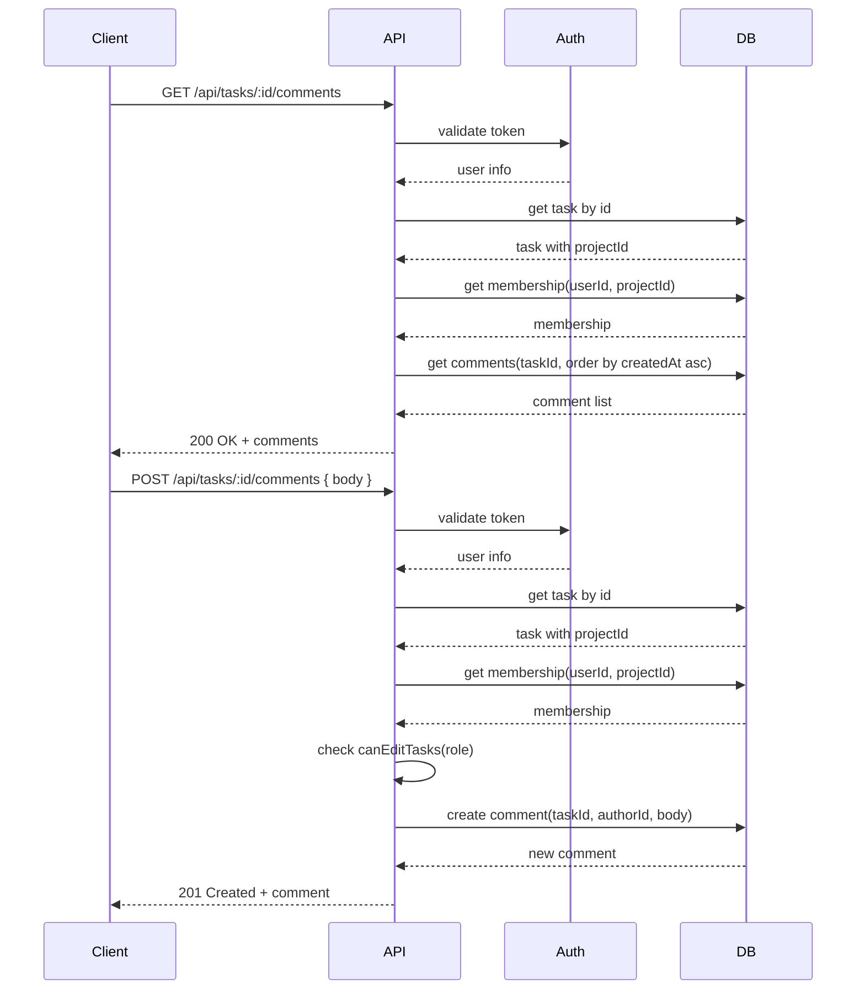

# Architecture for Task Comments Feature

## Overview
Add a chronological, append-only comments thread for tasks. Comments are part of the engagement audit trail and must be visible to all project members, but only members with write permissions may post. Comments cannot be edited or deleted once created.

## Goals
- Comments are chronological and immutable.
- Each comment shows author, body, and timestamp.
- Only project members may post comments.
- Viewers can read comments, but cannot post.
- Authorization is enforced on every API request.
- The API remains consistent with current project/task ownership and membership rules.

## Data Model
Extend Prisma schema with a new `Comment` model:

```prisma
model Comment {
  id        String   @id @default(cuid())
  taskId    String   @map("task_id")
  authorId  String   @map("author_id")
  body      String
  createdAt DateTime @default(now()) @map("created_at")

  task   Task @relation(fields: [taskId], references: [id], onDelete: Cascade)
  author User @relation(fields: [authorId], references: [id])

  @@index([taskId])
  @@map("comments")
}
```

- `taskId` links the comment to the task.
- `authorId` links to the user who posted it.
- `createdAt` preserves chronological ordering.
- No `updatedAt` or delete fields are added to enforce immutability.

## API Design
Add a task comment API under a task-specific route.

### Routes
- `GET /api/tasks/:id/comments`
  - Returns all comments for a task, ordered ascending by `createdAt`.
  - Authorization: any project member may read comments.

- `POST /api/tasks/:id/comments`
  - Creates a new comment for the task.
  - Authorization: only project members with `admin` or `member` role may post.
  - Input: `{ body: string }`
  - Output: newly created comment with author details.

### Authorization Flow
1. Validate user from `Authorization: Bearer <token>`.
2. Load task by `id` and resolve `projectId`.
3. Fetch membership using `getProjectMembership(user.id, projectId)`.
4. If no membership, return `403 forbidden`.
5. For `POST`, require `canEditTasks(membership.role)`.
6. For `GET`, any membership may read.

### Example Authorization Logic
- `GET /api/tasks/:id/comments`
  - membership exists -> allow
  - otherwise -> forbidden

- `POST /api/tasks/:id/comments`
  - membership exists && canEditTasks(role) -> allow
  - membership exists && role == viewer -> forbidden
  - otherwise -> forbidden

## API Response Shape
### GET
```json
{
  "comments": [
    {
      "id": "c1",
      "body": "Looks good.",
      "createdAt": "2026-05-13T12:00:00.000Z",
      "author": {
        "id": "u1",
        "name": "Meera",
        "email": "meera@taskboard.dev"
      }
    }
  ]
}
```

### POST
```json
{
  "comment": {
    "id": "c2",
    "body": "Please add tests.",
    "createdAt": "2026-05-13T12:05:00.000Z",
    "author": { "id": "u2", "name": "Arjun", "email": "arjun@taskboard.dev" }
  }
}
```

## UI/Frontend Flow
1. On task detail page, fetch comments from `GET /api/tasks/:id/comments`.
2. Render comments chronologically, oldest first.
3. Show author name, comment body, and posted timestamp.
4. If `currentUser` has `member` or `admin` role on the project, show a comment form.
5. Disable the comment input for viewers.
6. On submit, POST new comment and refresh the list or append the response.

## Client-side Authorization
- The frontend should use the current project membership state to conditionally render the comment form.
- The backend must still enforce authorization; the frontend is only UX guidance.

## Data Integrity and Immutability
- Comments are append-only by design.
- No update or delete routes are provided for comments.
- The DB model does not expose edit/delete metadata.

## Testing Plan
### Unit / API tests
- `GET /api/tasks/:id/comments` returns comments for a member
- `GET /api/tasks/:id/comments` rejects non-members with `403`
- `POST /api/tasks/:id/comments` allows `admin` and `member`
- `POST /api/tasks/:id/comments` rejects `viewer` with `403`
- `POST /api/tasks/:id/comments` rejects non-members with `403`
- Comments are returned in chronological order.

### Integration/behavior tests
- Verify comments are visible on task detail page.
- Verify viewers cannot see the post form.
- Verify newly posted comments appear immediately.

## Migration Considerations
- Add the `comments` table with a foreign key to `tasks` and `users`.
- No migration of existing data is required beyond schema creation.

## Summary Flow
1. User requests task comments.
2. Backend verifies membership on task project.
3. Backend returns ordered comments with author metadata.
4. Member posts a new comment.
5. Backend validates role, creates comment, returns immutable record.
6. Client renders comment thread chronologically.

## Sequence Diagram


---

If you want, I can also add a more detailed endpoint contract next.